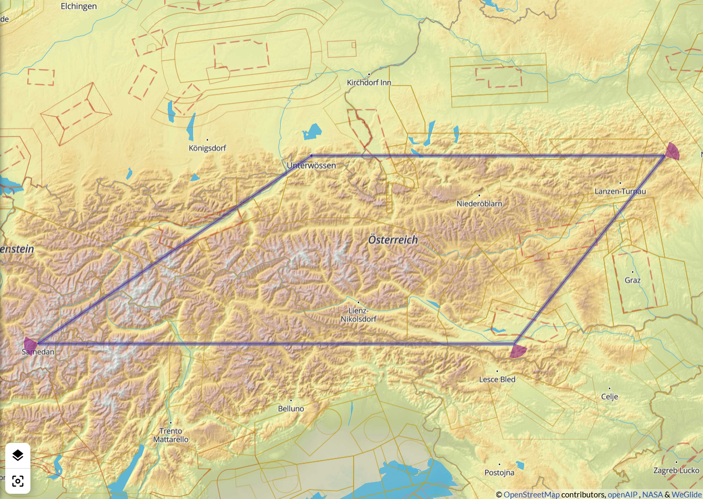

---
title: Vierecke ab Unterwössen
author: Mathias Münch
date: 2021-02-27
...

# Das DMSt-Viereck

## Motivation

- Nicht so langweilig wie ein Jojo.
- Abwechslungsreicher als ein Dreieck.
- Sonniger Süden inklusive.

> Viereckfliegen macht Laune.

## Formeln

Der zweite Wendepunkt entscheidet

- a + b + c < 500 km : a + b < c × 18/7 ~ c × 2,5
- a + b + c > 500 km : a + b < c × 3

# Wendepunkte

## Stagor

120 km × 2,5 = 300 km  → 2 × (a + b) = **600 km**

Zum Beispiel:

:   - Niederöblarn -- Stagor -- Sterzing: 477 km
    - Trieben -- Stagor -- Sterzing: 539 km

Anmerkungen:

:   - Wende im Osten im Unterwössener Vorgarten.
    - Frei vom Zeltweger Luftraum.
    - Kein Einflug in's Vintschgau.
    - Triebener Tauern 1274 m, Brenner 1370 m -- niedriger geht's nimmer.

## Stagor - Karte

{ width=80% }

## Spitzegel

140 km × 3 = 420 km  → 2 × (a + b) = **840 km**

Zum Beispiel:

:   - Timmersdorf -- Spitzegel -- Sterzing: 610 km
    - Turnau -- Spitzegel -- Köpfelplatte: 788 km

Anmerkungen:

:   - Zeltweg umfliegen ist möglich.
    - Große Strecken (> 700 km) ohne Vintschgau.
    - Richtig, richtig groß (wenn man will).

## Spitzegel - Karte

{ width=80% }

## Rote Wand

160 km × 3 ~ 500 km  → 2 × (a + b) ~ **1000 km**

Zum Beispiel:

:   - Dürre Wand -- Rote Wand -- Piz Nuna: 955 km
    
Anmerkungen:

:   - Zeltweg nur noch schwer zu umgehen.
    - Nockberge, Turracherhöhe, das volle Programm.

## Rote Wand - Karte

{ width=80% }

## Ferlach

200 km × 3 = 600 km  → 2 × (a + b) = **1200 km**

Da sind dann die Alpen zu Ende. Aber zum Beispiel:

:   - Rax -- Ferlach -- Samedan: 995 km

Anmerkungen:

:   - Landschaftlich traumhaft schön.
    - Basis 2600 m am Speikkogel ist genug.
    - Luftraum Zeltweg, aber nette Controller.
    - Karawanken Nord- oder Südseite?

## Ferlach - Karte

{ width=80% }

# Wermutstropfen

## Wind und Wetter

- Für die Südalpen bevorzugen wir Tage mit Nordströmung, oft kurz nach dem abzieheneden Tief.
- Mit dem ersten Schenkel nach Osten fliegen wir in zunehmenden Nordwind und in tiefere Basis.
- Schwierigkeiten oft im Bereich südlich Hochschwab und nach der Hauptkammquerung in den Niederen Tauern.
- Linie nördlich Hochschwab eventuell besser?

## Wettbewerbspunkte

- Für OLC nicht optimal.
- Vierecke werden nur angemeldet gewertet.

> Ist der Flug erst ruiniert, fliegt sich's gänzlich ungeniert

## Die lieben Gewohnheiten

- Westwende in der Silvretta? Oder gegen den Uhrzeigersinn?\
  Reutte -- Spitzegel -- Gößeck: 690 km
- Es gibt wunderschöne Dreiecke im Osten!\
  Mariazell -- Turracherhöhe: 501 km

> Eine Wettbewerbsregel, die nicht einschränkt, sondern anregt

## Westabflug - Karte

{ width=80% }

## Ostdreieck - Karte

{ width=80% }

# Diskussion

## Anhang

Beispiel-Aufgaben sind verfügbar in [WeGlide | Aufgaben](https://weglide.org/task/explore?order_by=-stars) unter "AFZ-Streckenflug-210227".
